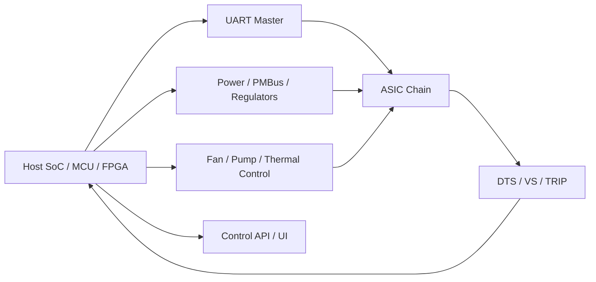
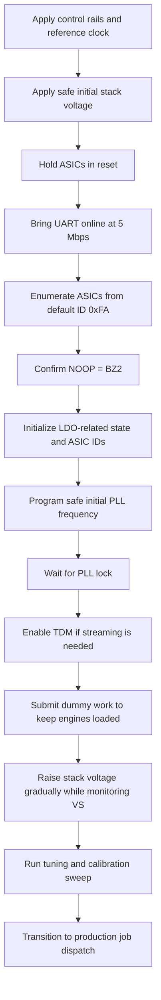

# Blockscale / BZM2 ASIC Hardware Integration Guide

## Purpose

This document consolidates ASIC-level behavior needed to design a custom
hardware solution around the Blockscale / BZM2 mining ASIC. It focuses on
generic implementation requirements:

- power architecture
- sequencing
- clocking
- UART transport
- multi-ASIC chaining
- telemetry
- protection
- tuning and calibration

It deliberately avoids copying vendor reference-board implementation details.
Those reference systems are useful examples, but they are not required for a
working design.

## Scope

This guide is for hardware developers building:

- a single-ASIC board
- a small multi-ASIC board with one or a few voltage domains
- a larger multi-ASIC platform with multiple voltage domains

The core constraint does not change with board size: every ASIC contains an
internal dual-stack engine arrangement and expects the host system to sequence,
clock, load, and protect it correctly.

## ASIC At A Glance

The shipped software and observable ASIC behavior consistently indicate the
following ASIC-level properties:

- `236` hashing engine tiles per ASIC
- `4` engines per tile
- `944` total engines per ASIC
- `2` primary PLL domains, corresponding to the bottom and top engine stacks
- on-die digital temperature sensing
- on-die three-channel voltage sensing
- UART as the primary host control and mining transport
- unicast, multicast, and broadcast job/register distribution
- TDM streaming for results, register responses, `NOOP`, and sensor data

Throughput per ASIC can be estimated as:

```text
Throughput (GH/s) = 236 * 4 * PLL_Frequency / 3 * Pass_Rate
```

Where:

- `PLL_Frequency` is in GHz
- `Pass_Rate` is `0.0` to `1.0`

Example:

```text
1.2 GHz * (236 * 4 / 3) * 1.0 = 377.6 GH/s
```

That formula is useful for sizing cooling, PSU headroom, calibration targets,
and per-domain operating points.

## Recommended System Partitioning

The ASIC does not require a specific vendor platform. It does require that the
overall system provide the following functions:

- stable control-side power
- stable stack-side power
- reference clock generation
- reset and trip handling
- UART master
- telemetry collection and protection logic
- work generation and result collection



The exact split is your design choice:

- a Linux SoC can own all logic directly
- an MCU can own power sequencing while a host CPU owns mining
- an FPGA can assist with fanout, timing, or board aggregation

The ASIC-facing requirements remain the same.

## Package, IO, And Mechanical Constraints

The package and interface behavior used by the shipped software indicate:

- package size: `7.5 x 7 mm`
- package type: exposed-die molded `FCLGA`
- total signal / land interfaces sized around `60` SLI pads and `60` LGA pads
- operating junction target range: roughly `55 C` to `85 C`
- absolute maximum junction temperature: `115 C`

Design implications:

- provide strong top-side thermal extraction
- assume continuous high leakage once stack voltage is present
- do not depend on reset state to keep thermal rise negligible
- plan for heatsink and forced airflow, or an equivalent thermal solution

Even a single-ASIC design should be treated as thermally active immediately
after hash rails are applied.

## Core Rails And Voltage Architecture

The ASIC is built around internal voltage stacking. The documents describe two
engine-stack ranges:

- bottom stack: approximately `0.0 V` to `0.355 V`
- top stack: approximately `0.355 V` to `0.71 V`

Additional named rails used by the legacy platform:

- GPIO / control IO: `1.2 V`
- `VDD_HASH`: nominal `0.71 V`
- `VDD_P75`: backup rail if the on-chip LDO path is unavailable

### Why voltage stacking matters

Voltage stacking is central to efficiency, but it also creates the main
hardware risk:

- the absolute stack voltages must stay inside safe limits
- the differential between the stacks must stay controlled
- bad sequencing or poor balancing can create overvoltage or thermal runaway

The ASIC includes internal voltage sensing specifically because the host must
monitor and react to stack imbalance.

### Voltage sensor channels

The internal voltage sensor reports three useful channels:

- `ch0`: bottom stack voltage
- `ch1`: top stack voltage
- `ch2`: differential between the stacks

For a custom design, treat those as first-class runtime safety inputs, not
debug-only data.

## Clocking

### External reference clock

The ASIC expects an external reference clock on `REFCLKIN`. The hardware
interface used by the shipped software assumes:

- `REFCLKIN` as the ASIC reference clock input
- maximum reference clock on that pin up to `50 MHz`

The same interface model also exposes `REFCLKOUT1` and `REFCLKOUT2`, primarily
as debug-oriented outputs.

### Internal PLLs

The ASIC uses two PLLs to feed the two internal engine stacks:

- `PLL0`: bottom stack
- `PLL1`: top stack

Bring-up implications:

- both PLLs are disabled by default
- software must enable them explicitly
- software must wait for lock before releasing dependent logic

When both divider classes are changed, the documented programming rule is:

1. write `FBDIV`
2. write `POSTDIV`

Do not reverse that order during live clock changes.

### DLL health

The legacy software also validates DLL state using `coarsecon` and `fincon`
status. That is not strictly required to boot the ASIC, but it is useful for:

- manufacturing validation
- marginal-clock debug
- SI validation at new board layouts or cable lengths

If you are building a custom carrier or long-chain design, budget time for DLL
health checks during validation.

## UART And Chain Topology

UART is the primary host interface for:

- enumeration
- register control
- job dispatch
- result retrieval
- TDM streaming
- sensor retrieval

### Practical UART assumptions

The shipped software consistently uses:

- default ASIC baud: `5 Mbps`
- host notch / slow clock during bring-up: `50 MHz`

The pad tables describe the UART-related pads as `1.2 V` IO. Treat this as a
real electrical requirement when selecting the host UART PHY or level-shifting
scheme.

### Chain orientation and pin muxing

The hardware interface uses a `PINSEL`-based pin muxing arrangement where the
same physical pins can serve as:

- `RX_IN` / `TX_OUT`
- `RESET_IN` / `RESET_OUT`
- `TRIP_IN` / `TRIP_OUT`

This is what enables daisy-chain style system layouts. For a generic design,
the important point is:

- your schematic must preserve a consistent direction through the chain
- reset and trip propagation need the same level of attention as RX/TX routing

### ASIC enumeration model

The enumeration flow implemented by the legacy stack is:

1. all ASICs start with default `ASIC_ID = 0xFA`
2. the host addresses `0xFA`
3. the first visible ASIC responds
4. the host writes a unique `ASIC_ID`
5. writing the ID also unlocks `RX_OUT`
6. the next ASIC becomes reachable
7. repeat until the chain is assigned

`NOOP` returning `BZ2` is the simplest chain-liveness check.

### Broadcast and multicast

The ASIC supports:

- unicast to one engine in one ASIC
- broadcast to the same engine position across all ASICs
- multicast to a row group

That capability is what makes large chains viable over UART. Use it for:

- initial register programming
- dummy-job deployment
- broad frequency ramps
- row-wise validation

Reserve unicast for:

- ASIC ID assignment
- per-ASIC final tuning
- fault isolation
- result ownership and targeted debug

## Power-Up And Bring-Up Sequence

The reusable logic for any custom board is:



### Practical bring-up rules

- start from a conservative voltage
- start from a conservative clock, typically much lower than final operating
  point
- do not ramp voltage or frequency without sensor feedback
- do not leave engines idle during stack-balancing phases if your control
  strategy depends on balanced load
- do not start full production mining until IDs, PLL lock, and basic telemetry
  are confirmed

### Dummy-job use is not optional in stacked systems

The shipped software treats dummy jobs as part of power balancing, not merely a
debug trick. In practice, dummy jobs help:

- keep engines drawing current
- maintain stack balance during ramp-up
- prevent some engines from sitting unloaded while others are active
- hold a repeatable thermal and electrical state during calibration

## Mining Programming Model

### Enhanced mode

Enhanced mode is the default engine programming mode. The implemented sequence
for a valid four-lane engine-tile submission is:

1. enable TCE clocks
2. program nonce bounds and target
3. load the four midstates
4. program four write-job sequences
5. only the fourth write enables execution

The four logical writes share:

- merkle root residue
- start timestamp

They differ by:

- midstate
- sequence ID

### Job control behavior

The `JobControl` modes matter operationally:

- `0x1`: mark pending job ready
- `0x2`: cancel current and pending job, return to idle
- `0x3`: abort current job and immediately launch pending job

That cancel path is essential for recovery from invalid or stale engine state.

### Partial and invalid programming

The legacy software behavior and protocol handling make the failure behavior
clear:

- partial programming can consume bytes from a following write and create
  unintended nonces
- launching before the fourth write can cause incomplete jobs to execute
- disabled TCE lanes still require software to maintain correct sequencing
- unused TCE lanes should be flushed with zeroed dummy content

Do not assume the ASIC silently sanitizes malformed software behavior.

## Telemetry And Protection

### Temperature sensing

The ASIC exposes a digital temperature sensor. The legacy software uses the
following conversion family:

```text
T = K + Y * (N - 2^11 / 2^R) / 2^12
```

Where:

- `T` = temperature in Celsius
- `N` = raw thermal tune code
- `R` = sensor resolution, typically `12`
- `Y = 631.8`
- `K = -293.8`

At default 12-bit resolution, a raw code near `2084` maps to approximately
`27.6 C`.

### Voltage sensing

The voltage conversion used by the legacy implementation is:

```text
V = 1000 * (2 / 5) * VREF * (6 * N / 2^14 - 3 / 2^R - 1)
```

Where:

- `V` = uncalibrated voltage in mV
- `N` = raw sensor code
- `R` = voltage-sensor resolution
- `VREF = 0.7067`

### Protection behavior

The ASIC can assert a trip output when thermal or voltage thresholds are
exceeded. A robust system should wire this into board-level protection.

Recommended policy:

- use sensor data for continuous host-side supervision
- use the trip path for fast hardware or firmware response
- treat temperature and differential stack voltage as shutdown-class signals
- never rely on software polling alone for destructive fault containment

## Calibration Methodology

The calibration material is useful as methodology, but not as a fixed set of
numbers. The reusable sequence is:

1. characterize a single ASIC or a small golden sample
2. choose conservative initial voltage and frequency
3. reset all ASICs to the safe starting point
4. bring stack voltage to a safe operating region
5. use dummy jobs to keep the electrical state stable
6. raise frequency in steps, commonly `25 MHz` coarse steps
7. measure pass rate, throughput, temperature, current, and power
8. raise voltage only if throughput targets cannot be met within thermal and
   power limits
9. once the board-level operating region is found, fine-tune individual ASICs
   in smaller steps, for example `6.25 MHz`
10. persist the resulting operating point for restart reuse

### Calibration inputs that should be board-specific

The following should be measured on your own design, not copied from a vendor
reference system:

- PSU current limits
- PSU power limits
- board thermal limits
- acceptable stack imbalance
- safe junction temperature target
- fan or pump response curves
- pass-rate thresholds for field use

### What scales from 1 ASIC to 100 ASICs

A practical strategy for scale is:

- characterize at the domain level first
- then fine-tune per ASIC

For example:

- `1 ASIC`: one domain, direct per-ASIC tuning
- `4 ASICs`: tune the shared rail first, then trim per ASIC if needed
- `100 ASICs`: first establish safe per-domain voltage and coarse clock, then
  apply per-ASIC final offsets

That is also the model implemented in the Rust tuning planner in this
repository.

## Design Recommendations By System Size

### Single-ASIC board

Recommended priorities:

- keep power sequencing simple and deterministic
- expose UART, reset, and trip for debug access
- expose DTS/VS in firmware or API from day one
- use direct per-ASIC characterization rather than heavy-weight broadcast flows

### Small multi-ASIC board

Recommended priorities:

- decide early whether all ASICs truly share one rail policy
- keep chain routing short and deterministic
- implement broadcast writes and per-ASIC unicast verification
- maintain enough sensor visibility to identify one bad ASIC quickly

### Large multi-domain system

Recommended priorities:

- treat domain balancing as a system function, not an afterthought
- separate board protection from mining software
- use broadcast for coarse actions and unicast for final trim
- persist calibration state and replay it on restart
- provide out-of-band observability for voltage, current, and trip events

## Common Failure Modes

Expect these classes of issues during bring-up:

- chain breaks due to mux orientation or RX/TX direction errors
- false confidence from UART liveness before IDs or PLLs are fully initialized
- stack imbalance during idle or partial-load operation
- thermal runaway from insufficient cooling during early ramp
- residual engine programming causing unexpected nonces
- malformed partial write-job sequences
- assuming all engine IDs are contiguous or present

Design for fast isolation:

- per-domain current and voltage visibility
- easy reset control
- easy UART capture
- per-ASIC NOOP and register-read debug
- trip logging

## Minimum Validation Checklist

Before calling a hardware platform ready, verify:

- control IO is truly `1.2 V` compatible
- reference clock integrity at the ASIC pin
- reset propagation through the entire chain
- per-ASIC enumeration from default ID
- `NOOP` response integrity across the full chain
- stable PLL lock across the intended operating range
- valid DTS/VS readings for every ASIC
- no dangerous stack imbalance at idle, dummy load, and production load
- sustained production pass rate at target operating point
- protection response for overtemperature and stack-voltage faults

## Relationship To The Mujina Rust Implementation

This repository already includes a practical Rust implementation of the core
ASIC behavior discussed above:

- UART opcode support
- TDM parsing
- PLL and DLL diagnostics
- DTS/VS telemetry
- on-demand sensor query support
- startup tuning and saved operating-point replay
- board and API diagnostics for low-level validation

Relevant follow-on documents:

- [UART and TDM Reference](blockscale-uart-protocol-reference.md)
- [BZM2 Port Note](bzm2-port.md)
- [BZM2 Tuning Planner](bzm2-pnp.md)
