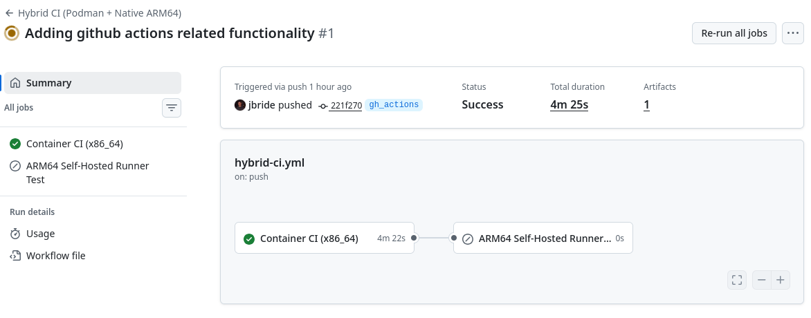

**Hybrid CI Setup Guide**

This guide explains how to set up and use the hybrid CI system that uses 

## 1. Overview

The hybrid CI system provides:

1. **Container-based CI**: Fast, reproducible builds using Podman containers
2. **ARM64 cross-compilation**: Build ARM64 binaries on x86_64 runners
3. **Real hardware testing**: Deploy and test on actual ARM hardware via SSH
4. **Flexible deployment**: Works with GitHub Actions and local development


## 2. Github Actions

This project includes a _workflow_ called [hybrid-ci.yml](../.github/workflows/hybrid-ci.yml) that gets automatically triggered in Github with every commit.
The workflow also allows for manual trigger via the Github UI.




Notice in the `hybrid-cli.yml`, configuration exists for specifying the branches that github actions will automatically run on:


```
name: Hybrid CI (Podman + Native ARM64)
      
on:     
  push:
    branches: [ main, master, preview, gh_actions]
  pull_request:
    branches: [ main, master, preview, gh_actions ]
```

Modify the list of branches to support your development efforts as necessary.

## 3. Local testing

This project also includes a [Makefile](../scripts/local_ci/Makefile.ci) that can be run in your local dev environment.
These commands are for local use only and are not used by GitHub Actions.

On a x86_64 based development environment, verify that all compilation and testing is successful on both the of the following:

* x86_64 environment
* ARM64 environment using cross-compilation toolchain.

All compilation and tests occur in a linux container using podman.

### 3.1. Prerequisites

- **Podman**

### 3.2. Execute

```bash
$ make -f scripts/local_ci/Makefile.ci ci-containers-arm64-cross-compilation
```

## 4. Local Setup (ARM64 deploy)

### 4.1. Prerequisites

- **Podman** installed on your system
- **SSH access** to ARM64 hardware (ie: Raspberry Pi 4)

### 4.2. Configuration

Create your ARM deployment configuration:

```bash
# Copy the template
cp scripts/local_ci/arm-deployment.template scripts/local_ci/arm-deployment.env

# Edit with your details
vi scripts/local_ci/arm-deployment.env
```

### 4.3. Usage

```bash
$ make -f scripts/local_ci/Makefile.ci deploy-arm
```

### 4.4. Volume Management

#### 4.4.1. Manual Volume Cleanup

If you encounter issues with mixed architectures or need to clean up build artifacts, you can manually manage the Podman volumes:

```bash
# List all volumes
podman volume ls

# Remove specific CI volumes
podman volume rm cargo-registry cargo-git cargo-target

# Remove all unused volumes
podman volume prune

# Force remove all volumes (use with caution)
podman volume rm --all
```

#### 4.4.2. Volume Locations

The CI system uses these volumes:
- `cargo-registry`: Rust package registry cache
- `cargo-git`: Git dependencies cache  
- `cargo-target`: Build artifacts cache
